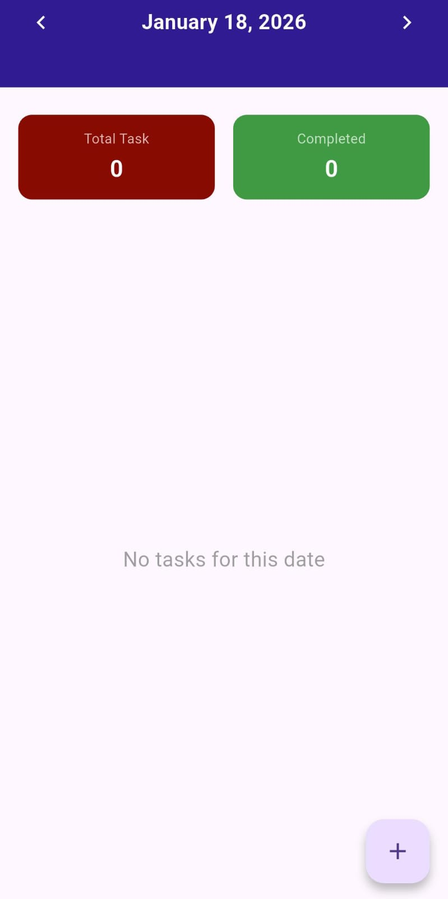

# 📝 Todo App

Todo App is a **Flutter-based mobile application** designed to help users manage daily tasks based on selected dates.  
This project was created as a learning exercise to understand the fundamentals of Flutter development.

---

## 📱 Features

- View tasks by selected date
- Add new tasks
- View total and completed tasks
- Delete tasks
- Simple and clean user interface

---

## 📸 Screenshots

<p align="center">
  
  
</p>

---

## 🛠️ Tech Stack

- **Flutter**
- **Dart**

---

## 📚 Reference

This project is inspired by the following YouTube tutorial playlist:

https://youtube.com/playlist?list=PLtxqM_JR-PFhRlwA9GDyCjWL6zm19PkAY

The tutorial was used as a learning reference, with modifications and reimplementation during development.

---

## 🚀 How to Run the Project

1. Make sure Flutter is installed
2. Clone the repository:
   ```bash
   git clone https://github.com/Arsyaaahhh/todo.git
   ```
3. Navigate to the project directory:
    ```bash
   cd todo
4. Install dependencies:
    ```bash
   flutter pub get
5. Run the apllication:
    ```bash
   flutter run
